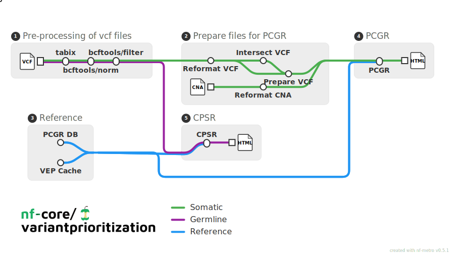

<h1>
  <picture>
    <source media="(prefers-color-scheme: dark)" srcset="docs/images/nf-core-variantprioritization_logo_dark.png">
    
  </picture>
</h1>

[](https://github.com/codespaces/new/nf-core/variantprioritization)
[](https://github.com/nf-core/variantprioritization/actions/workflows/nf-test.yml)
[](https://github.com/nf-core/variantprioritization/actions/workflows/linting.yml)[](https://nf-co.re/variantprioritization/results)[](https://doi.org/10.5281/zenodo.XXXXXXX)
[](https://www.nf-test.com)

[](https://www.nextflow.io/)
[](https://github.com/nf-core/tools/releases/tag/3.5.2)
[](https://docs.conda.io/en/latest/)
[](https://www.docker.com/)
[](https://sylabs.io/docs/)
[](https://cloud.seqera.io/launch?pipeline=https://github.com/nf-core/variantprioritization)

[](https://nfcore.slack.com/channels/variantprioritization)[](https://bsky.app/profile/nf-co.re)[](https://mstdn.science/@nf_core)[](https://www.youtube.com/c/nf-core)

## Introduction

**nf-core/variantprioritization** is a bioinformatics analysis pipeline for the functional annotation and translation of somatic SNVs/InDels and copy number abberations for precision cancer medicine using [Personal Cancer Genome Reporter (PCGR)].
**nf-core/variantprioritization** offers germline SNVs/INDELS intepretation and annotation using [Cancer Predisposition Sequencing Reporter (CPSR)](https://github.com/sigven/cpsr/).

<picture>
    <source media="(prefers-color-scheme: dark)" srcset="docs/images/pipeline_dark.svg">
    
</picture>

The workflow has been designed to accept outputs generated by [nf-core/sarek](https://github.com/nf-core/sarek):

| Tool                   |      Germline      | Somatic tumor-normal | Somatic tumor-only |
| ---------------------- | :----------------: | :------------------: | :----------------: |
| ASCAT                  |                    |  :heavy_check_mark:  | :heavy_check_mark: |
| DeepVariant            | :heavy_check_mark: |                      |                    |
| HaplotypeCaller        | :heavy_check_mark: |                      |                    |
| Mutect2                |                    |  :heavy_check_mark:  | :heavy_check_mark: |
| Strelka somatic indels |                    |  :heavy_check_mark:  |                    |
| Strelka somatic snvs   |                    |  :heavy_check_mark:  |                    |

## Usage

The workflow accepts as input a `samplesheet.csv` file containing the paths to SNV/InDel VCF files and `ASCAT` copy number abberation files. We have efforted to mimick the [samplesheet specifications of nf-core/sarek](https://github.com/nf-core/sarek/blob/master/docs/usage.md#input-sample-sheet-configurations) for ease of use:

| Column  | Description                                                                                                          |
| ------- | :------------------------------------------------------------------------------------------------------------------- |
| patient | Designates the patient/subject; must be unique for each patient, but one patient can have multiple samples           |
| status  | Normal/tumor (0/1) status of sample                                                                                  |
| sample  | Designates the sample ID; must be unique. A patient may have multiple samples e.g a paired tumor-normal, tumor-only. |
| vcf     | Full path to VCF file(s)                                                                                             |
| cna     | Full path to segment file                                                                                            |

An example of a valid samplesheet is given below:

```bash
patient,status,sample,vcf,cna
HCC1395,1,HCC1395T,HCC1395T_vs_HCC1395N.mutect2.vcf.gz,HCC1395T.segments.txt
HCC1395,1,HCC1395T,HCC1395T_vs_HCC1395N.freebayes.vcf.gz,HCC1395T.segments.txt
HCC1395,1,HCC1395T,HCC1395T_vs_HCC1395N.strelka.somatic_snvs.vcf.gz,HCC1395T.segments.txt
HCC1395,1,HCC1395T,HCC1395T_vs_HCC1395N.strelka.somatic_indels.vcf.gz,HCC1395T.segments.txt
HCC1395,0,HCC1395N,HCC1395N.deepvariant.vcf.gz,
HCC1395,0,HCC1395N,HCC1395N.haplotypecaller.vcf.gz,
HCC1396,1,HCC1396T,HCC1396T_vs_HCC1396N.mutect2.vcf.gz,
HCC1396,1,HCC1396T,HCC1396T_vs_HCC1396N.strelka.somatic_snvs.vcf.gz,
HCC1396,1,HCC1396T,HCC1396T_vs_HCC1396N.strelka.somatic_indels.vcf.gz,
```

> copy number abberation files must be present for every sample entry when `--cna_analysis true`.

Now, you can run the pipeline using:

```bash
nextflow run nf-core/variantprioritization \
   -profile <docker/singularity/.../institute> \
   --input samplesheet.csv \
   --outdir <OUTDIR>
```

> [!WARNING]
> `-profile conda` is not working with the CPSR and PCGR modules at the moment. We are working on a fix and hope to enable it in a future release.

> [!WARNING]
> Please provide pipeline parameters via the CLI or Nextflow `-params-file` option. Custom config files including those provided by the `-c` Nextflow option can be used to provide any configuration _**except for parameters**_; see [docs](https://nf-co.re/docs/usage/getting_started/configuration#custom-configuration-files).

For more details and further functionality, please refer to the [usage documentation](https://nf-co.re/variantprioritization/usage) and the [parameter documentation](https://nf-co.re/variantprioritization/parameters).

## Credits

nf-core/variantprioritization was originally written by @barrydigby, @yussab and @matbonfanti. @famosab joined to adapt the pipeline to nf-core standards towards a first release.

We thank the following people for their extensive assistance in the development of this pipeline:

- [Nathan Thorpe](https://github.com/nathanthorpe)

- [Sam Minot](https://github.com/sminot)

- [Sigve Nakken](https://github.com/sigven)

## Contributions and Support

Please open an issue or reach out to me (Youssef Abili) on the nf-core slack channel.

I am interested in adding compatability for additional variant calling tools and optimising the intake of large VCF files.

## Citations

> **Cancer Predisposition Sequencing Reporter (CPSR): A flexible variant report engine for high-throughput germline screening in cancer**
> Nakken S, Saveliev V, Hofmann O, Møller P, Myklebost O, Hovig E.
>
> _Int J Cancer._ 2021 Dec 1;149(11):1955-1960. doi:[10.1002/ijc.33749](https://doi.org/10.1002/ijc.33749)

> **Personal Cancer Genome Reporter: variant interpretation report for precision oncology**
> Nakken S, Fournous G, Vodák D, Aasheim LB, Myklebost O, Hovig E.
>
> _Bioinformatics._ 2018 May 15;34(10):1778-1780. doi: [10.1093/bioinformatics/btx817](https://doi.org/10.1093%2Fbioinformatics%2Fbtx817)

> **Sarek: A portable workflow for whole-genome sequencing analysis of germline and somatic variants**
> Garcia M, Juhos S, Larsson M, Olason PI, Martin M, Eisfeldt J, DiLorenzo S, Sandgren J, Díaz De Ståhl T, Ewels P, Wirta V, Nistér M, Käller M, Nystedt B.
>
> _F1000Res._ 2020 Jan 29;9:63. doi: [10.12688/f1000research.16665.2](https://doi.org/10.12688%2Ff1000research.16665.2)

> **The nf-core framework for community-curated bioinformatics pipelines.**
>
> Philip Ewels, Alexander Peltzer, Sven Fillinger, Harshil Patel, Johannes Aln
